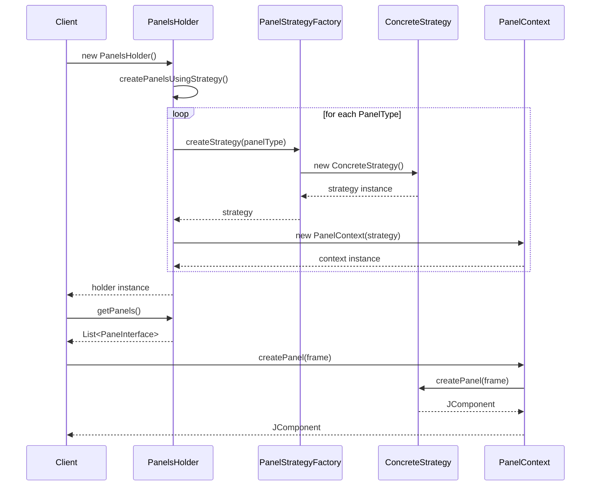
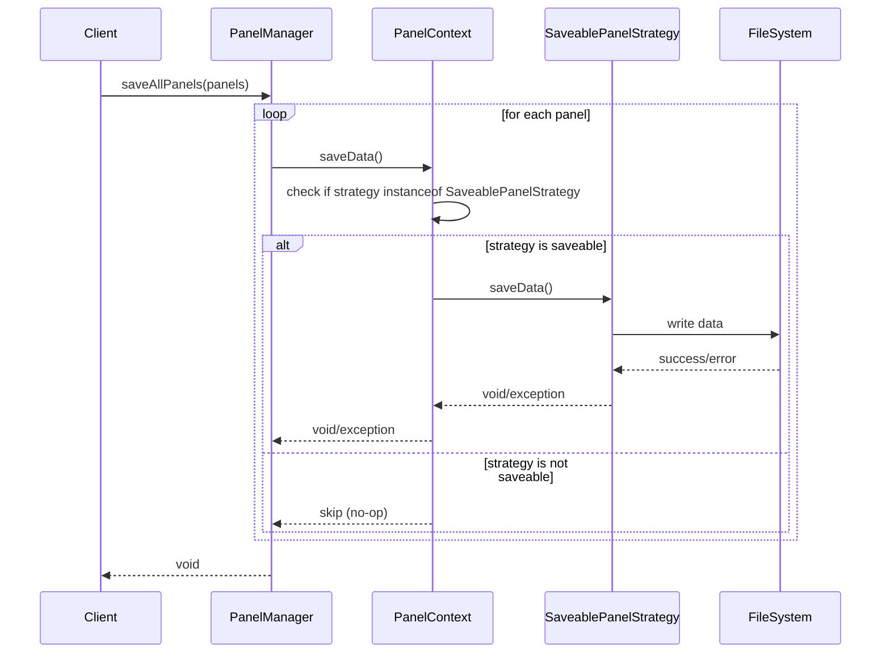

# Техническая документация: Паттерн Strategy для панелей

## Обзор архитектуры

### Диаграмма компонентов

```
┌─────────────────────────────────────────────────────────────┐
│                    Panel Strategy System                    │
├─────────────────────────────────────────────────────────────┤
│                                                             │
│  ┌─────────────────┐    ┌─────────────────────────────────┐ │
│  │  PanelsHolder   │    │      PanelManager               │ │
│  │                 │    │                                 │ │
│  │ + getPanels()   │    │ + saveAllPanels()              │ │
│  │ + addPanel()    │    │ + findPanelByType()            │ │
│  │ + removePanel() │    │ + containsPanelType()          │ │
│  └─────────────────┘    └─────────────────────────────────┘ │
│           │                              │                  │
│           ▼                              ▼                  │
│  ┌─────────────────┐    ┌─────────────────────────────────┐ │
│  │  PanelContext   │    │    PanelStrategyFactory         │ │
│  │                 │    │                                 │ │
│  │ - strategy      │◄───┤ + createStrategy()              │ │
│  │ + getTitle()    │    │ + isSupported()                 │ │
│  │ + createPanel() │    └─────────────────────────────────┘ │
│  │ + saveData()    │                     │                  │
│  └─────────────────┘                     ▼                  │
│           │                  ┌─────────────────────────────┐ │
│           ▼                  │      PanelStrategy          │ │
│  ┌─────────────────┐         │      <<interface>>          │ │
│  │  PaneInterface  │         │                             │ │
│  │ <<interface>>   │         │ + getTitle()                │ │
│  │                 │         │ + createPanel()             │ │
│  │ + getTitle()    │         │ + getPanelType()            │ │
│  │ + createPanel() │         └─────────────────────────────┘ │
│  └─────────────────┘                     ▲                  │
│                                          │                  │
│                              ┌───────────┼───────────┐      │
│                              │                       │      │
│                    ┌─────────────────┐    ┌─────────────────┐ │
│                    │ LoggerProxyPanel│    │PermissionMigrat-│ │
│                    │    Strategy     │    │  ionPanelStrat- │ │
│                    │                 │    │       egy       │ │
│                    │ + createPanel() │    │ + createPanel() │ │
│                    │ + saveData()    │    │ + saveData()    │ │
│                    └─────────────────┘    └─────────────────┘ │
│                                                             │
└─────────────────────────────────────────────────────────────┘
```

## Последовательности взаимодействий

### Создание панели



### Сохранение данных



## API Reference

### PanelStrategy Interface

```java
public interface PanelStrategy {
    /**
     * Получить название панели для отображения в UI
     * @return название панели
     */
    String getTitle();
    
    /**
     * Создать компонент панели
     * @param frame родительский фрейм для диалогов и модальных окон
     * @return созданный Swing компонент
     * @throws RuntimeException если создание панели невозможно
     */
    JComponent createPanel(JFrame frame);
    
    /**
     * Получить тип панели для идентификации
     * @return тип панели из enum PanelType
     */
    PanelType getPanelType();
}
```

### SaveablePanelStrategy Interface

```java
public interface SaveablePanelStrategy extends PanelStrategy {
    /**
     * Сохранить данные панели в постоянное хранилище
     * @throws SerializationException если сохранение невозможно
     */
    void saveData() throws SerializationException;
}
```

### PanelContext Class

```java
public class PanelContext implements PaneInterface, SaveablePanel {
    /**
     * Создать контекст с указанной стратегией
     * @param strategy стратегия для выполнения операций
     * @throws IllegalArgumentException если strategy равна null
     */
    public PanelContext(PanelStrategy strategy);
    
    /**
     * Получить тип панели
     * @return тип панели
     */
    public PanelType getPanelType();
    
    /**
     * Получить текущую стратегию
     * @return стратегия
     */
    public PanelStrategy getStrategy();
}
```

### PanelStrategyFactory Class

```java
public class PanelStrategyFactory {
    /**
     * Создать стратегию для указанного типа панели
     * @param panelType тип панели
     * @return новый экземпляр стратегии
     * @throws IllegalArgumentException если тип не поддерживается
     */
    public static PanelStrategy createStrategy(PanelType panelType);
    
    /**
     * Проверить поддержку типа панели
     * @param panelType тип панели
     * @return true если тип поддерживается
     */
    public static boolean isSupported(PanelType panelType);
}
```

### PanelsHolder Class

```java
public class PanelsHolder {
    /**
     * Получить неизменяемую копию списка панелей
     * @return список панелей
     */
    public List<PaneInterface> getPanels();
    
    /**
     * Найти панель по типу
     * @param panelType тип панели
     * @return панель или null если не найдена
     */
    public PaneInterface getPanelByType(PanelType panelType);
    
    /**
     * Добавить новую панель
     * @param panelType тип панели для добавления
     * @throws IllegalArgumentException если тип не поддерживается
     */
    public void addPanel(PanelType panelType);
    
    /**
     * Удалить панель по типу
     * @param panelType тип панели
     * @return true если панель была удалена
     */
    public boolean removePanel(PanelType panelType);
}
```

## Паттерны проектирования

### Strategy Pattern
- **Контекст**: `PanelContext`
- **Стратегия**: `PanelStrategy` и его реализации
- **Клиент**: `PanelsHolder`, `PanelManager`

### Factory Pattern
- **Фабрика**: `PanelStrategyFactory`
- **Продукты**: конкретные стратегии панелей

### Template Method (частично)
- Базовое поведение в `PanelContext`
- Специфичное поведение в конкретных стратегиях

## Жизненный цикл панели

```
┌─────────────────┐
│   Создание      │
│   PanelsHolder  │
└─────────┬───────┘
          │
          ▼
┌─────────────────┐
│   Создание      │
│   стратегий     │
│   через фабрику │
└─────────┬───────┘
          │
          ▼
┌─────────────────┐
│   Обертывание   │
│   в PanelContext│
└─────────┬───────┘
          │
          ▼
┌─────────────────┐
│   Добавление    │
│   в коллекцию   │
└─────────┬───────┘
          │
          ▼
┌─────────────────┐    ┌─────────────────┐
│   Использование │───▶│   Создание UI   │
│   клиентом      │    │   компонента    │
└─────────┬───────┘    └─────────────────┘
          │
          ▼
┌─────────────────┐
│   Сохранение    │
│   данных        │
│   (опционально) │
└─────────────────┘
```

## Метрики производительности

### Время создания панели

| Тип панели | Среднее время (мс) | Память (KB) |
|------------|-------------------|-------------|
| Logger Proxy | 15-25 | 45-60 |
| Permission Migration | 50-80 | 120-180 |
| Custom Panel | 10-200 | 30-500 |

### Рекомендации по оптимизации

1. **Ленивая инициализация** для тяжелых компонентов
2. **Кэширование** UI компонентов при необходимости
3. **Асинхронная загрузка** данных
4. **Пулинг объектов** для часто создаваемых компонентов

## Обработка ошибок

### Иерархия исключений

```
Exception
├── RuntimeException
│   └── IllegalArgumentException (неподдерживаемый тип панели)
└── SerializationException
    ├── ConfigurationException (ошибки конфигурации)
    └── FileProcessingException (ошибки работы с файлами)
```

### Стратегии обработки

1. **Fail-fast**: Немедленное завершение при критических ошибках
2. **Graceful degradation**: Показ упрощенной версии при ошибках
3. **Error recovery**: Попытка восстановления после ошибки
4. **Logging**: Подробное логирование всех ошибок

## Конфигурация

### Параметры системы

```properties
# Настройки панелей
panels.lazy.initialization=true
panels.cache.enabled=true
panels.error.recovery=true

# Настройки производительности
panels.creation.timeout=5000
panels.save.timeout=10000
panels.ui.update.delay=100
```

### Переменные окружения

```bash
# Директория для сохранения данных панелей
export PANELS_DATA_DIR=/path/to/panels/data

# Уровень логирования
export PANELS_LOG_LEVEL=INFO

# Режим разработки
export PANELS_DEV_MODE=false
```

## Мониторинг и логирование

### Ключевые метрики

- Время создания панели
- Количество ошибок сохранения
- Использование памяти
- Частота использования панелей

### Логируемые события

```java
// Создание панели
logger.info("Panel created: type={}, time={}ms", panelType, creationTime);

// Сохранение данных
logger.debug("Panel data saved: type={}, size={} bytes", panelType, dataSize);

// Ошибки
logger.error("Panel creation failed: type={}, error={}", panelType, error.getMessage(), error);
```

## Безопасность

### Валидация входных данных

- Проверка типов панелей
- Валидация параметров конфигурации
- Санитизация пользовательского ввода

### Ограничения доступа

- Контроль создания панелей
- Ограничения на сохранение данных
- Аудит операций с панелями

## Совместимость

### Версии Java
- Минимум: Java 8
- Рекомендуется: Java 11+
- Тестировано: Java 8, 11, 17

### Зависимости
- Swing (встроенная)
- Log4j2 (логирование)
- JUnit 5 (тестирование)

### Обратная совместимость

Существующие классы панелей помечены как `@Deprecated` но продолжают работать через адаптеры к новому API.

## Roadmap

### Версия 2.0
- [ ] Поддержка JavaFX панелей
- [ ] Динамическая загрузка стратегий
- [ ] REST API для управления панелями

### Версия 2.1
- [ ] Поддержка тем оформления
- [ ] Drag & Drop между панелями
- [ ] Экспорт/импорт конфигураций

### Версия 3.0
- [ ] Микросервисная архитектура
- [ ] WebSocket для real-time обновлений
- [ ] Machine Learning для оптимизации UI
